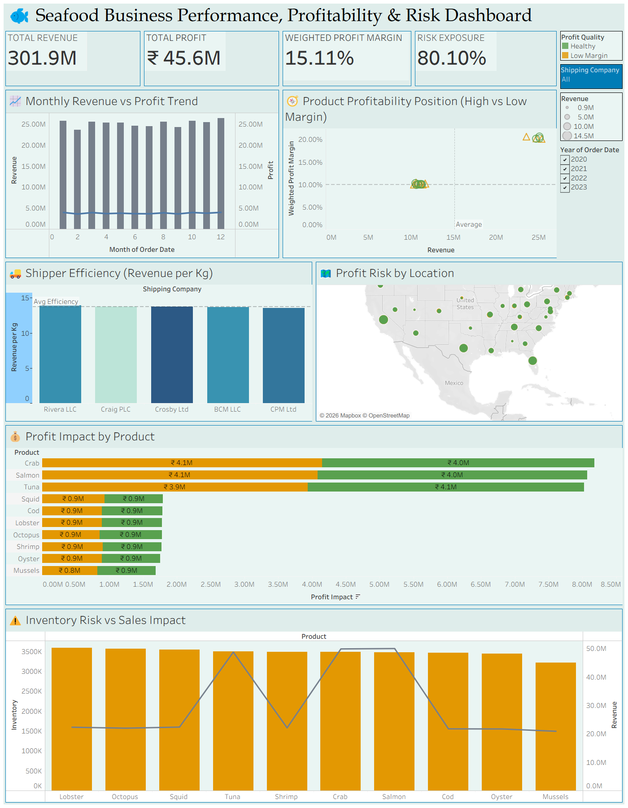
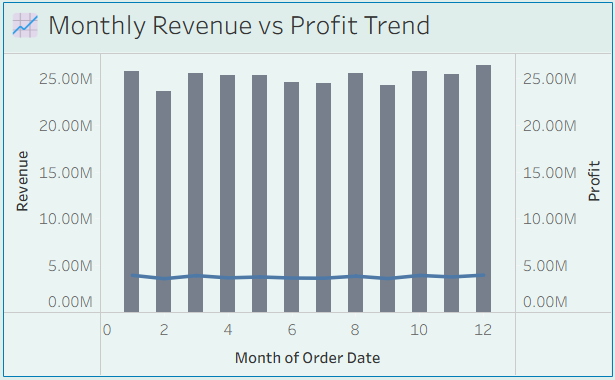
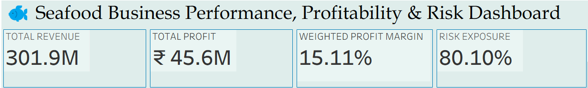

# 📊 Seafood Business Performance, Profitability & Risk Dashboard

## 📌 Overview

This project presents an interactive Tableau dashboard designed to analyze seafood business performance, profitability, and risk exposure across different products, regions, and time periods. The goal is to provide actionable insights that support data-driven decision-making in business operations.

---

## 🛠️ Tools & Technologies

* Tableau
* Microsoft Excel

---

## 📷 Dashboard Preview

---

## 📊 Dashboard Components & Logic

### 1️⃣ KPI Metrics

The dashboard tracks key performance indicators:

* **Total Revenue:** 301.9M
* **Total Profit:** ₹45.6M
* **Weighted Profit Margin:** 15.11%
* **Risk Exposure:** 80.10%

These KPIs provide a quick overview of business performance.

---

### 2️⃣ Monthly Revenue vs Profit Trend

* Bar chart represents revenue
* Line chart represents profit
* Helps identify trends and seasonal patterns

**Insight:** Revenue remains stable while profit shows slight fluctuations.

---

### 3️⃣ Product Profitability Analysis

* Scatter plot comparing revenue vs weighted profit margin
* Identifies high-margin vs low-margin products

**Insight:** Some high-revenue products generate lower margins → potential risk area.

---

### 4️⃣ Shipping Efficiency (Revenue per Kg)

* Compares efficiency across shipping companies
* Evaluates operational performance

**Insight:** Certain shipping partners perform better in revenue efficiency.

---

### 5️⃣ Geographic Risk Analysis

* Map visualization of profit risk by location
* Bubble size indicates risk level

**Insight:** Certain regions contribute more to overall business risk.

---

### 6️⃣ Profit Impact by Product

* Horizontal bar chart showing product-level profit contribution

**Insight:** Few key products drive the majority of profits.

---

### 7️⃣ Inventory Risk vs Sales Impact

* Combined bar and line chart
* Compares inventory levels with revenue

**Insight:** High inventory does not always correlate with higher revenue.

---

## 🎛️ Filters & Interactivity

The dashboard includes interactive filters:

* Shipping Company
* Revenue range
* Year (2020–2023)
* Profit Quality (Healthy vs Low Margin)

These filters allow dynamic exploration of data.

---

## 📁 Project Structure

sales-dashboard-tableau/
├── dashboard-overview.png
├── sales-insights.png
├── final dashboard exam.twb
└── README.md

---

## 🚀 How to Use

1. Download the `.twb` file
2. Open using Tableau Desktop
3. Use filters to explore insights
4. Analyze trends and business performance

---

## 🎯 Key Learnings

* Built end-to-end Tableau dashboard
* Applied data visualization best practices
* Developed business insights from raw data
* Improved analytical and storytelling skills

---

## 👩‍💻 Author

Madhumitha Ramakrishnan
LinkedIn: https://linkedin.com/in/madhumitha-ramakrishnan-6a5998355
GitHub: https://github.com/Madhumitha0109

---

## ⭐ Feedback

If you found this project useful, feel free to give a ⭐ and connect with me on LinkedIn!
